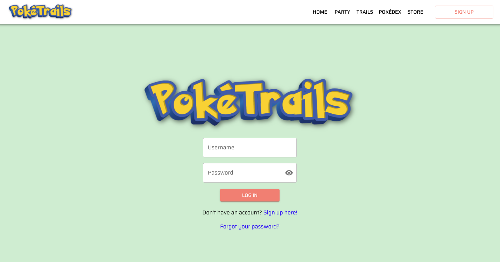
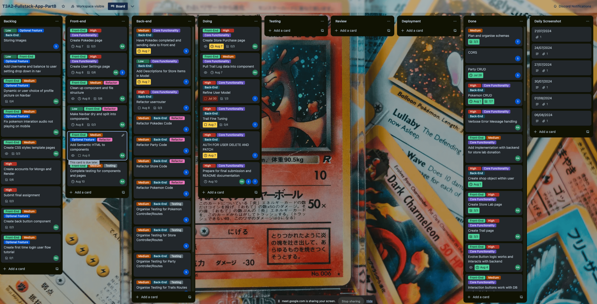

# PokéTrails Web Application

**Developed by Rahal Abeyrathna, Suraj Shrestha, and Talie Hodge**

---

## 🚀 Deployed Applications

- **Front End Deployed App Site:** [https://poketrails.com](https://poketrails.com)
- **Front End Development Site:** [https://dev.poketrails.com](https://dev.poketrails.com)
- **Back End API:** [https://api.poketrails.com](https://api.poketrails.com)

## 📂 Repositories

- **Documentation:** [PokeTrailsDocs](https://github.com/PokeTrails/PokeTrailsDocs)
- **Client:** [poketrails-frontend](https://github.com/PokeTrails/poketrails-frontend)
- **Server:** [poketrails-backend](https://github.com/PokeTrails/poketrails-backend)

## 📄 Documentation

## Frontend Install Instrcutions

1. **Clone the Front-End Repository**:
   - Use the following command to clone the repository:

     ```bash
     git clone git@github.com:PokeTrails/poketrails-frontend.git
     ```

2. **Install Dependencies**:
   - Navigate to the project directory and install the required npm dependencies:

     ```bash
     npm install
     ```

3. **Start the Application**:
   - Launch the application with the following command:

     ```bash
     npm start
     ```

4. **Access the Application**:
   - Open your browser and go to [localhost:5173](http://localhost:5173/)

5. **Verify Backend Server Is Running**:
   - Ensure the backend server is running on port 8080 using the instructions provided below.

## Backend Install Instructions

1. **Create a `.env` File**:
   - In the root directory of the project, create a `.env` file and add the following configuration:

     ```sh
     PORT=8080
     DATABASE_URL="YOUR URL HERE"
     JWT_KEY="YOUR JWT KEY HERE"
     ```

2. **Start MongoDB (WSL Users)**:
   - If you are using Windows Subsystem for Linux (WSL), start MongoDB with:

     ```sh
     sudo systemctl start mongod
     ```

3. **Start the Server in Development Mode**:
   - Install the packages needed for the app

     ```sh
     npm run dev
     ```

   - Use the following command to start the server:

     ```sh
     npm run dev
     ```

4. **Seed Data to the Database**:
   - Populate the database with initial data by running:

     ```sh
     npm run seed
     ```

5. **Login Details**:
   - For user login, use the following credentials:

     ```sh
     USERNAME: user3
     PASSWORD: user3
     ```

## Endpoints

### Authentication

| **Operation** | **URL**                | **Method** | **Body**                                   | **Access**           |
|---------------|------------------------|------------|--------------------------------------------|----------------------|
| Login          | `/login`                | POST       | `{"username": "abc", "password": "abc"}`   | Public               |

### Pokémon

| **Operation**                       | **URL**                                | **Method** | **Body**                      | **Access**           |
|-------------------------------------|----------------------------------------|------------|-------------------------------|----------------------|
| Create a New Pokémon                | `/pokemon`                             | POST       | -                             | Protected (JWT)      |
| Get All Pokémon                     | `/pokemon`                             | GET        | -                             | Protected (JWT)      |
| Get All Donated Pokémon             | `/pokemon/donated`                     | GET        | -                             | Protected (JWT)      |
| Get Pokémon by ID                   | `/pokemon/:pokemonID`                  | GET        | -                             | Protected (JWT)      |
| Set/Edit Pokémon Nickname           | `/pokemon/nickname/:pokemonID`         | PATCH      | `{"nickname": "<NewNickname>"}` | Protected (JWT)      |
| Hatch Pokémon                       | `/pokemon/hatch/:pokemonID`            | PATCH      | -                             | Protected (JWT)      |
| Donate Pokémon                      | `/pokemon/donate/:pokemonID`           | PATCH      | -                             | Protected (JWT)      |
| View Donation Reward                | `/pokemon/donate/reward/:pokemonID`    | GET        | -                             | Protected (JWT)      |
| Talk with Pokémon                   | `/pokemon/talk/:pokemonID`             | PATCH      | -                             | Protected (JWT)      |
| Play with Pokémon                   | `/pokemon/play/:pokemonID`             | PATCH      | -                             | Protected (JWT)      |
| Feed Pokémon                        | `/pokemon/feed/:pokemonID`             | PATCH      | -                             | Protected (JWT)      |
| Evolve Pokémon                      | `/pokemon/evolve/:pokemonID`           | PATCH      | -                             | Protected (JWT)      |

### Pokedex

| **Operation**       | **URL**            | **Method** | **Body** | **Access**           |
|---------------------|--------------------|------------|----------|----------------------|
| Get Pokedex Data    | `/pokedex`         | GET        | -        | Protected (JWT)      |

### Party

| **Operation**                      | **URL**           | **Method** | **Body** | **Access**           |
|------------------------------------|-------------------|------------|----------|----------------------|
| Get Party Details                  | `/party`          | GET        | -        | Protected (JWT)      |

### Store

| **Operation**           | **URL**                   | **Method** | **Body** | **Access**           |
|-------------------------|---------------------------|------------|----------|----------------------|
| Get All Items           | `/store`                  | GET        | -        | Protected (JWT)      |
| View Item by ID         | `/store/view/:id`         | GET        | -        | Protected (JWT)      |
| Buy Item by ID          | `/store/buy/:id`          | PATCH      | -        | Protected (JWT)      |

### User

| **Operation**         | **URL**                 | **Method** | **Body**                                                       | **Access**           |
|-----------------------|-------------------------|------------|----------------------------------------------------------------|----------------------|
| Create a New User     | `/user/signup`          | POST       | `{"username": "James", "trainerName": "James3", "sprite": "boySprite", "password": "password"}` | Public               |
| Login a User          | `/user/login`           | POST       | `{"username": "James", "password": "password"}`               | Public               |
| Delete a User         | `/user/delete/:userID`  | DELETE     | -                                                              | Protected (JWT)      |
| Edit a User           | `/user/patch/:userID`   | PATCH      | -                                                              | Protected (JWT)      |
| Find a User by ID     | `/user/find/:userID`    | GET        | -                                                              | Protected (JWT)      |
| Find All Users        | `/user`                 | GET        | -                                                              | Protected (JWT)      |

### Trail

| **Operation**         | **URL**                          | **Method** | **Body**                                             | **Access**           |
|-----------------------|----------------------------------|------------|------------------------------------------------------|----------------------|
| Send on Trail         | `/trail/simulate`                 | POST       | `{"title": "Wild Trail", "pokemonId": "12123123aseasdasda"}` | Protected (JWT)      |
| Finish Trail          | `/trail/finish`                  | POST       | `{"pokemonId": "12123123aseasdasda"}`                | Protected (JWT)      |
| Find a Trail by Title | `/trail/:trailtitle` (e.g., `wettrail`) | GET        | -                                                    | -                    |
| Get All Trails        | `/trail/`                        | GET        | -                                                    | -                    |
| Delete a Trail by Title | `/trail/:trailtitle` (e.g., `wettrail`) | DELETE     | -                                                    | -                    |
| Patch a Trail by Title | `/trail/:trailtitle` (e.g., `wettrail`) | PATCH      | Any fields present on Trail Model (e.g., `{"length": "12030"}`) | -                    |

## Libaries Used

### Front-end

- **`react` (v18.3.1)**: The core library for building user interfaces. React's component-based architecture allows for the creation of reusable UI components, ensuring a modular and maintainable codebase.

- **`react-dom` (v18.3.1)**: Provides DOM-specific methods that are used by React to render components into the DOM. This is essential for managing updates to the UI.

- **`react-router-dom` (v6.25.1)**: Facilitates routing and navigation in the application. It allows the creation of a dynamic, single-page application with client-side routing capabilities.

### Styling and UI

- **`@mui/material` (v5.16.4)**: A popular React UI framework that provides a comprehensive set of components and styles based on Material Design principles. This library is used for building a responsive and visually appealing user interface.

- **`@mui/icons-material` (v5.16.4)**: Includes a set of Material Design icons that can be used in the application to enhance the visual representation and user interaction.

- **`@emotion/react` (v11.13.0) and `@emotion/styled` (v11.13.0)**: Used for writing CSS styles with JavaScript. Emotion provides a flexible and efficient way to style components in React, with support for dynamic styling and theming.

- **`@fontsource/roboto` (v5.0.13) and `@fontsource/saira` (v5.0.28)**: Custom font loading library to include Roboto and Saira fonts in the application, ensuring a consistent and modern typography. Roboto is used as a backup font, Saira is used as the main font in the application.

### Development and Build Tools

- **`vite` (v5.3.4)**: A fast and modern build tool that provides an optimized development experience with features such as hot module replacement (HMR) and efficient bundling.

- **`@vitejs/plugin-react` (v4.3.1)**: A Vite plugin that provides React-specific features such as fast refresh and automatic JSX transformation, optimizing the development workflow.

### State Management and Data Handling

- **`axios` (v1.7.2)**: A promise-based HTTP client for making API requests. It simplifies data fetching and error handling, making it easier to interact with backend services.

- **`dotenv` (v16.4.5)**: Loads environment variables from a `.env` file into `process.env`, allowing for configuration and secrets management outside of the codebase.

### Testing

- **`cypress` (v13.13.2)**: An end-to-end testing framework that provides a reliable way to write and run tests for the application's UI, ensuring that user interactions and workflows function as expected.

- **`mocha` (v10.7.3)**: A test framework for writing unit and integration tests. Mocha provides a flexible and extensible testing environment.

- **`mochawesome` (v7.1.3) and `mochawesome-merge` (v4.3.0)**: Reporters for Mocha that generate detailed and visually appealing test reports, which can be used to analyze test results and coverage.

### Additional Features

- **`howler` (v2.2.4)**: A library for managing audio in the application, providing support for features like sound playback, control, and customization. Used to play Pokémon cry sounds.

- **`react-confetti` (v6.1.0)**: A lightweight React component for rendering confetti animations, adding visual effects to celebrate events or interactions in the application. Used in the Pokémon hatching pop up to add a bit more style and interaction for the user.

### Back-end

- **bcryptjs**: Used for securing user passwords by hashing them before storing them in the database. It also provides a method to verify hashed passwords against plain text inputs, enhancing application security by ensuring safe user authentication.

- **cors**: Manages and controls access to resources from different domains. It allows or restricts requests from external origins, ensuring that only authorized domains can interact with the API, thus preventing unauthorized access while enabling legitimate cross-origin requests.

- **dotenv**: Facilitates secure management of environment variables by loading configurations from a `.env` file into `process.env`. This keeps sensitive information like API keys and database credentials out of the source code, improving security and making it easier to manage different environments (development, testing, production).

- **express**: A web framework used to build server-side logic and manage HTTP requests and responses. It provides robust features for routing, middleware support, and integration with various templating engines, simplifying the definition of routes and processing of requests.

- **jsonwebtoken**: Manages user authentication by generating a token that encodes user information (e.g., user ID) using a secret key. This token is sent to the client and used for authenticating subsequent requests, ensuring secure access by verifying the token's authenticity.

- **mongoose**: An Object Data Modeling (ODM) library for interacting with MongoDB. It offers a schema-based solution to model application data, allowing easy creation, reading, updating, and deletion of database records. Mongoose also provides data validation, middleware support, and complex querying capabilities.

- **nodemon**: A development tool that automatically monitors project files for changes and restarts the server when code changes are detected. This ensures that the application reflects the latest updates without needing manual server restarts.

- **jest**: A testing framework designed to ensure code reliability and correctness. It offers a suite of utilities for writing unit and integration tests, verifying that the application functions as expected.

- **supertest**: An HTTP assertion library used for testing API endpoints. It simulates HTTP requests to Express routes, allowing verification of the API's behavior in different scenarios and ensuring that endpoints operate correctly.

## Testing

### Front-end Testing

Front-end testing was conducted through multiple stages to ensure the application met our quality standards and functioned as intended across various environments.

#### Local Development Testing

Each feature was developed locally and thoroughly tested in a local development environment. This initial testing phase involved verifying the functionality of individual functions, components, and pages.

#### Public Development Testing

Once features were deemed stable in the local environment, they were pushed to a development branch. Here, testing was conducted using a public development database to simulate real-world usage and ensure compatibility with production settings. This phase also included testing on different devices and screen sizes, such as tablets and smartphones, to ensure the application’s accessibility and responsiveness.

#### Production User Testing

Features were then tested in a staging environment that closely mirrored the production setup. This phase involved gathering feedback from real users to validate the usability and functionality of the application in a near-production environment.

#### Automated Testing with Cypress

Automated tests were run using Cypress to validate the overall functionality and performance of the application. Cypress testing included various scenarios to ensure comprehensive coverage and identify any potential issues early in the development process.

Detailed results from user testing, including feedback and observations related to the login and sign-up workflows, are documented in a spreadsheet available in the GitHub repository. Additionally, a screenshot capturing further notes from the user testing is also provided in the same directory.

The results of the automated testing conducted with Cypress can be found in the Output.html file.

For additional context and visualization, screenshots of the testing processes and results are provided below, including commits and pushes to the dev branch:


### Back-end Testing

## Overview

Backend testing was carried out meticulously to ensure the robustness, security, and accuracy of API endpoints as outlined in the project specifications. The testing process was comprehensive, covering all aspects from data validation to performance under load, and ensuring secure access through proper authentication mechanisms. The testing was divided into several phases, including local, staging, and production environments, each designed to thoroughly validate each feature under various conditions and scenarios, from typical use cases to potential edge cases. This approach ensured that the API was not only functional but also resilient and scalable.

### Local Development Testing

Initial testing of the backend API routes was conducted in a local environment using Postman. Each route was subjected to detailed scrutiny, ensuring correct HTTP status codes, response bodies, and JWT token authentication where applicable. The testing process involved various scenarios, including valid and invalid inputs, boundary conditions, and error responses. Special attention was given to edge cases, such as handling of malformed requests, rate limiting, and ensuring proper data validation rules were enforced. Logging and error reporting mechanisms were also verified to ensure that they provided sufficient information for debugging and monitoring. This phase focused on verifying the basic functionality and ensuring that the API could handle different input cases reliably, preparing it for more rigorous testing in later stages.

### Production Environment Testing

Final testing was conducted in the production environment using the live API. This testing phase was critical to validate that all endpoints functioned as expected in a real-world setting with actual user data. In addition to functional testing, this phase included performance and stress testing to evaluate the API's behavior under heavy load, ensuring that it could scale appropriately without degradation of service. Security testing was also a key focus, with JWT authentication being rigorously tested for vulnerabilities such as token expiration, revocation handling, and protection against unauthorized access. The overall API performance, including response times, was measured to ensure it met the required standards. Monitoring tools were employed to track the API's health and performance metrics, ensuring that any issues could be quickly identified and addressed.

### Summary

The backend testing process was comprehensive and covered all possible scenarios, from normal operation to potential edge cases. Each endpoint was tested rigorously across different environments, ensuring not only correct functionality but also security, scalability, and resilience. Automated tests were implemented to facilitate continuous integration and catch regressions early in the development process. All tests passed successfully, and the API was deemed ready for production deployment. The detailed logs and results from the testing phases are stored in the project repository for further reference, providing a clear audit trail and insights for future development and maintenance.


### Deployed Application Screenshots

#### Main Menu


#### Login



#### Sign Up


#### Store Menu


#### Store Donate Pokémon


#### Store Item Upgrade


#### Trails Menu


#### Trails Pokémon Return


#### Rocky Trails


#### Frosty Trails


#### Wet Trails


#### Wild Trails


#### Party


#### Pokedex


#### Donation Reward


## Trello Project Management (Part B)

Much like our Part A, we utilized Trello as our primary tool for delegating tasks, tracking progress, and setting due dates. Trello's intuitive interface allowed us to effectively organize our workflow and ensure that every team member was aware of their responsibilities. We made extensive use of Trello’s features, such as labels, checklists, and due dates, to streamline the planning process and keep everything on track. On each Saturday, we would review and update the Trello board with new tasks and priorities for the upcoming week, ensuring that everyone was aligned with the project's goals and deadlines.

We decided to split the project into back-end and front-end development, and delegated our tasks and deliverables according to each members strengths and weaknesses. As a result, Rahal was given the front-end to work on as he had more experience working with frameworks such as Material UI which would help him get the website up and running faster, and because he created the wireframes and so would be most comfortable designing the pages. Suraj and Talie were then given back-end to work on, as they were much more comfortable and familiar with MongoDB and working with databases. This led us to complete our tasks and goals in a timely fashion which may not have been possible if we did not take these factors into account.

To complement our use of Trello, we scheduled regular meetings on Saturdays, Tuesdays, and Mondays to discuss progress, address any blockers, and plan the next steps. These meetings provided a structured opportunity to collaborate, share updates, and ensure that the project was progressing smoothly. In addition to our scheduled meetings, we remained flexible and arranged ad hoc meetings throughout the week whenever we encountered questions, needed assistance, or had new ideas to discuss.

Our primary communication tool was Discord, where we created a dedicated server for the project. This server served as the central hub for all project related discussions, file sharing, and meeting coordination. Within the Discord server, we stored a Google Meet link, which we used for all our virtual meetings. This setup allowed us to quickly jump into meetings and collaborate effectively, regardless of where team members were located. The combination of Trello for task management and Discord for communication created a seamless workflow.

When reviewing the Trello board, you'll notice that each card is marked with the first initial of the team member responsible for that task, making it clear who is accountable for its completion. We've utilized color coded labels to convey essential information about each task.

- Priority levels are indicated by:
  - Red for high priority,
  - Orange for medium priority, and
  - Dark Green for low priority.
  
- Task type is identified by:
  - Light Green for front-end work, and
  - Dark Blue for back-end tasks.

- Feature classification is denoted by:
  - Purple for core functionality, and
  - Blue for optional features.

This system allowed us to easily manage and prioritize tasks, ensuring that everyone was on the same page and that the most critical work received the attention it needed.

### [Link to trello board](https://trello.com/b/sKn4uEWQ/t3a2-fullstack-app-partb)

## Screenshots of Trello Board

### 21/07


### 24/07


### 27/07


### 30/07


### 01/08


### 06/08



### 11/08


